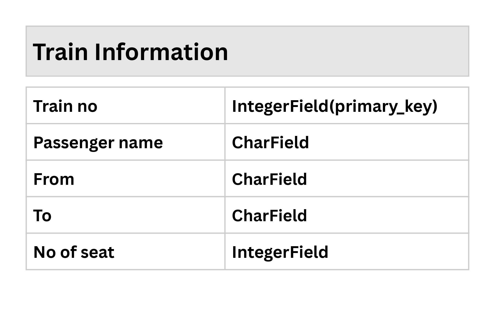
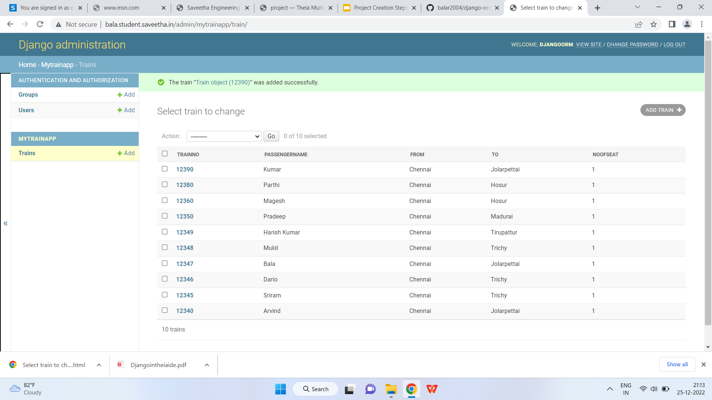

# Django ORM Web Application

## AIM
To develop a Django application to store and retrieve data from a database using Object Relational Mapping(ORM).

## Entity Relationship Diagram

ER diagram here


## DESIGN STEPS

### STEP 1:
Clone the repository to theia ide. Start a new app inside the project folder

### STEP 2:
Type the appropriate code for your table and provide appropriate data types to the columns

### STEP 3:
Create a report about in readme.md file and upload the django-orm-app folder to your remote repository

Write your own steps

## PROGRAM
```
from django.db import models
from django.contrib import admin
# Create your models here.
class Train(models.Model):
    Trainno=models.IntegerField(primary_key=True, help_text="Trainno")
    Passengername=models.CharField(max_length=100)
    From=models.CharField(max_length=100)
    To=models.CharField(max_length=100)
    Noofseat=models.IntegerField()
class Traininfo(admin.ModelAdmin):
    list_display = ("Trainno","Passengername","From","To","Noofseat")
```
## OUTPUT




## RESULT
Thus the project is developed to have Train Ticketbooking information database